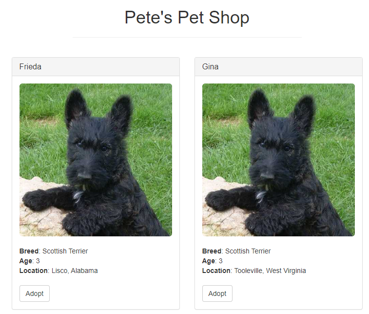
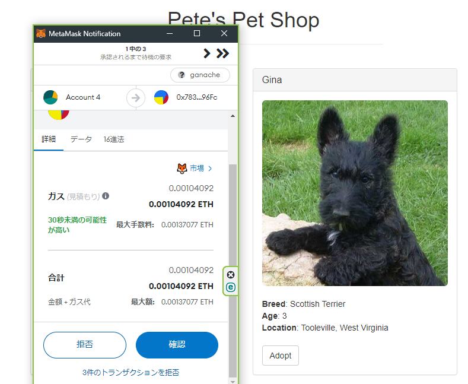
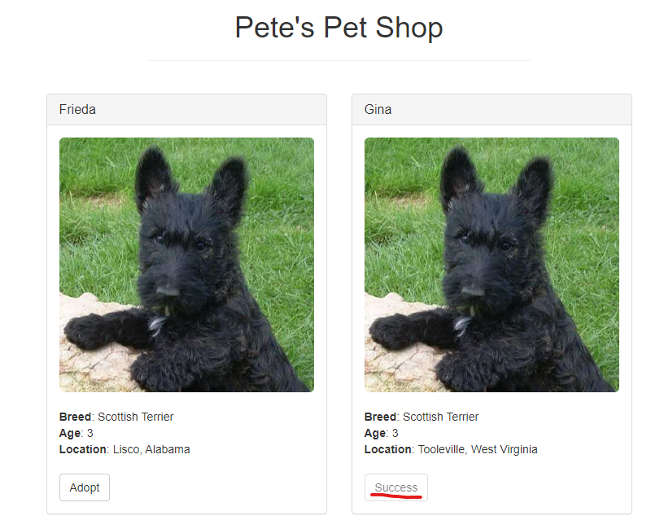
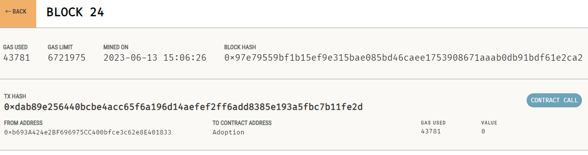

# 事前準備
- MetaMaskに新しいネットワーク（Ganache）登録
  - ネットワーク名：Ganache
  - 新しいRPC URL：http://127.0.0.1:7545
  - チェーンID：1337（Ganacheはデフォルトで5777を返すはずだが、1337が返ってくるらしいので使用）
  - 通貨記号：ETH
  - ブロックエクスプローラーのURL：未記入

- MetaMaskに Ganache のテストアカウントをインポート
  - 100 ETH 取得済み
   
## NOTE
Chromeの拡張機能の MetaMask Legacy が利用できないバグ？があるので、下記リンクから手動でインストールする必要がある、とのこと
https://xn--github-o63e6qja.com/MetaMask/legacy-web3-extension
  
# 実行（webサーバ立てる）
rootディレクトリにて
```
npm run dev
```
http://127.0.0.1:7545
にアクセスするとペットショップDAppが開く

# Demo
### トップページ

### トランザクション

### トランザクション承認後

### Ganacheネットワーク

